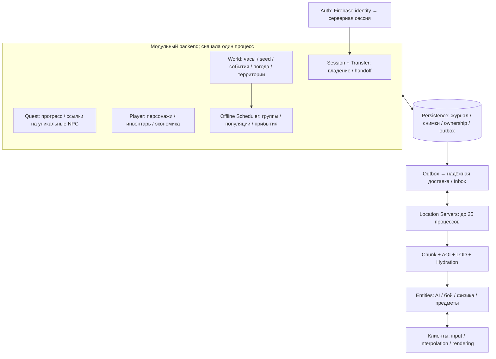

# 42. Живой мир: исполнимые контракты и первый этап

Дата: 2026-10-05. Основание — ТЗ владельца о 25 локациях, 512 игроках
в Зоне и 128 игроках в одной локации. Это **целевой масштаб**, а не
подтверждённая производительность текущей сборки.

Документ уточняет [проект 41](41_WORLD_ARCHITECTURE.md). При расхождении
применяются контракты этого документа. Последовательность новых работ:
Clock → World State → Location → Chunk/AOI → LOD → Ownership → Persistence
→ Transfers → Quests → Weather/Emission → Advanced offline simulation.
Сохранение ALife уже было добавлено до этой последовательности.

## 1. Проверенная исходная точка и границы этого изменения

В репозитории есть ALife online/offline, серверное выполнение игровых
действий, сохранение персонажей, `netcoop_world_store.inc`, серверные
костры, погодные/выбросные Lua-скрипты и ограничение рассылки по дистанции.
ALife — пригодная основа представления сущностей и сохранений, **но его
online/offline нельзя считать уже реализованными LOD 2/3 этого ТЗ**:
групповая аналитика, событийный catch-up и независимость результата от
наблюдателя требуют отдельных изменений.

В этой итерации реализованы `WorldClock`, `LocationClock`, `ClockSample`,
`WorldStateSnapshot`, `IWorldService`, `LocalWorldService` в
`src/xrGame/netcoop_world_clock.h`. Следующая итерация подключает ядро
к `CALifeTimeManager` для серверов с `-netcoop_world=<name>`:
`ALifeWorldClock` обслуживает календарь ALife, серверные time packets и
environment time factor. 64-битный `steady_clock` не зависит от таймера
рендеринга/Alt-Tab/32-битного wrap. Mutex защищает чтения ALife worker и
server main thread; monotonic sample берётся внутри lock.
Обычный freeplay без persistent world option сохраняет прежние часы.
Пакет GitHub Actions включает `1-Server.cmd` с `-netcoop_world=lostzone`;
старые установленные launchers сами от коммита не меняются. Limit=2 в
проверочном launcher не является заявлением готовности 128 игроков.

`WorldAuthorityStore` удерживает OS exclusive lock и до загрузки ALife
атомарно записывает новую epoch в `<world>.authority` с checksum.
WorldID/seed сохраняются; пропущенная epoch после неудачного старта не
переиспользуется. Это **один процесс на локальной папке сохранений**, без
SQLite, межпроцессного ClockSync, distributed lease или поддержки SMB/NFS.
Игровые time packets остаются совместимыми; `LocationClock` ещё не
подключён к клиентскому/межлокационному транспорту.

Часы и их identity/revision записываются в один снимок ALife через
опциональный trailer существующего time chunk. Legacy save принимается
как явная миграция; clock-aware save другого WorldID/seed либо с epoch,
не меньшей текущей, отклоняется. После рестарта offline время заморожено
до восстановления; автоматического catch-up не добавлено. Calendar-only
scale=0 и Lua calendar jump запрещены в persistent мире: физика/движение
ещё не имеют общего pause/catch-up barrier. Положительное изменение scale
не создаёт скачка времени. Старый engine может прочитать prefix, но
сохранять новый persistent мир старым engine нельзя: он потеряет trailer.

Готового World Service и кластера из 25 локаций эта интеграция не создаёт.

Дополнительно исправлен блокер предыдущей CI-сборки W1: защищённая
изменяемая перегрузка `CALifeSimulator::objects()` заменена публичным
const-доступом. При выборе слота сохранения используется указатель
последнего успешного снимка: после рестарта нельзя перезаписывать его
из-за обнуления счётчика. Указатель принимает только два слота своего мира.
Новые LZW3 manifests содержат размер/checksum обоих файлов — ALife `.scop`
и GAMMA script state `.scoc` (тайники, pstor, задачи и моды). Оба файла
flush-ятся до commit указателя. Перед save удаляется только старый sidecar
неактивного слота: молча отказавший Lua save не может принять старые данные
за новое script state. `.scoc` обязателен для нового persistent GAMMA save.
Повреждённый pointer, отсутствующий committed save/sidecar
или checksum mismatch останавливает загрузку вместо генерации нового мира.
Legacy pointer принимается один раз и обновляется следующим commit.
Нет автоматического выбора backup при повреждении: нужна явная recovery.
Это не заменяет будущий журнал событий и испытания с аварийным завершением.
До W7 возможна потеря несохранённых последних пяти минут и несогласованность
world snapshot с отдельно сохранённым персонажем; crash-safe item ledger
этой итерацией не заявляется.

Неизменённые рабочие изменения мебели/тайников и состояния персонажа
сохраняются отдельно. Сон/недосып не входит в новое состояние мира или
Clock API; индивидуальный сон не ускоряет время всем игрокам.

Изменение владельца от 2026-10-05 заменяет старые пункты про respawn/TTL:
NPC и мутанты имеют конечную начальную популяцию, не возрождаются и не
пополняются автоматически. Обычные предметы на земле и тайники не
исчезают по таймеру; удаляться могут тела и временные визуальные эффекты.
`zz_netcoop_world_rules.script` отключает штатный smart-terrain/SMR
replenishment на сервере. Initial population и scripted quest creation
остаются отдельными путями; автоматические spawn-пути дополнительных
модов ещё нужно проверить в этапе population/ownership. Редкие визиты
NPC к тайникам и сохранённые death tombstones описаны ниже и **ещё не
исполняются новым scheduler**.

## 2. Топология и границы authority



World Service хранит глобальный seed, календарь, фазу времени, расписания,
межфракционные отношения, контроль территории и группы в межлокационном
пути. RAM: текущий снимок, heap ближайших событий, кэш справочников.
БД: версии состояния, глобальный журнал и расписания. На каждый кадр
World Service не получает координаты, пули, физику или анимации.

Location Server — единственный писатель точного состояния своей локации
под `location_epoch`. В RAM: онлайн-объекты, spatial index, AOI игроков,
AI, физика, кэш abstract records и очереди гидрации. БД: важные изменения,
ownership, снимки; анимация, perception target и позиция каждого кадра
не записываются. Замена процесса получает новую эпоху и отсекает старого.

Quest Service владеет версиями квестов и требованиями к уникальным
сущностям. Player Store владеет durable персонажем и экономическими
транзакциями; Location владеет его текущим игровым состоянием под lease.
Transfer/Session единолично меняет владельца персонажа и admission.
Одна учётная запись Firebase не является доказательством права на любой
CharacterID, ItemID или произвольный серверный запрос.

БД — источник durable ownership и результатов транзакций. Bus доставляет
уже committed сообщения. Ни шина, ни Redis-кэш не назначают владельца.
Сначала допускается внутрипроцессная очередь; критический результат всё
равно фиксируется в транзакции до отправки/подтверждения. SQLite подходит
одному процессу хранения на одной машине. Для общего ownership нескольких
хостов — PostgreSQL с транзакциями/row locks; локальные SQLite-файлы
локаций не могут решать межсерверный ownership независимо друг от друга.

## 3. Общий envelope, ID и доставка

Каждое управляющее сообщение содержит:

```text
schema_version, WorldID, MessageID, CorrelationID, producer_id,
producer_epoch, aggregate_id, aggregate_version, event_sequence,
occurred_world_ms, payload
```

`EntityID`, `CharacterID`, `ItemID`, `EventID` — постоянные 128-bit ID
в будущем wire/storage контракте. Текущие движковые u16 ID — временные
handles; таблица сопоставления хранит `(persistent_id, runtime_id,
location_epoch, spawn_generation)`. Повторно использованный u16 не
означает, что вернулся прежний NPC. В W2 `WorldID/epoch/seq` представлены
u64; размер wire EntityID не зависит от этого внутреннего Clock API.

Гарантия доставки — at-least-once. Эффект операции — один committed
результат благодаря `Inbox(consumer, MessageID)` и `CommandResult`.
Сохранять только «последний seq отправителя» недостаточно: пришедшее
раньше позднее сообщение не должно заставить пропустить промежуточный
LootMoved. Порядок нужен **внутри aggregate**. При разрыве версии
запросить недостающий журнал или новый снимок, блокируя запись aggregate.
ClockSync отдельно допускает пропуск промежуточных samples.

Outbox записывается вместе с изменением состояния. Sender повторяет до
ACK с ограниченным backoff; consumer ACK только после commit inbox и
результата. Payload одной idempotency key обязан совпадать по hash;
другая операция с той же key возвращает конфликт. Нет обещания exactly-once
доставки транспорта. Для команд есть размер, deadline, проверка auth,
лимит очереди и rate limit. Просроченная команда не создаёт поздний эффект.

Детерминизм: canonical encoding + SHA-256 от `(WorldSeed, EventID,
ChunkID, WorldDay, SimulationVersion)`, фиксированный PRNG и порядок
участников по PersistentID. Не использовать `std::hash`, Lua math.random,
порядок hash map или client time. Для воспроизводимости encounter нужны
**одинаковые входные состояния и версия алгоритма**, одного seed мало.
Committed результат события авторитетен, его не переигрывают при hydration.

## 4. Clock и World State

Authority хранит `(WorldID, world_ms, scale, authority_epoch, sequence)`.
RAM anchor: локальный 64-bit monotonic timestamp. `now = anchor_world +
(mono_now - anchor_mono) × scale`. Wall clock не используется в игровом
цикле. Смена scale сначала сохраняет now, затем заменяет scale: непрерывно.
World seed стабилен на протяжении существования мира. Новый мир получает
новый WorldID; рестарт не создаёт новый seed.

ClockSample отправляется при подключении/восстановлении, раз в 5 реальных
секунд и при смене scale. Snapshot несёт состояние и clock одной версии.
Location фиксирует время отправки запроса и получения ответа **на своих
часах**, оценивает задержку по RTT/2. Timestamp другого хоста сравнивать
своим нельзя. Для push-канала нужно измерение RTT отдельным probe.
RTT/2 — приближение: асимметрия задержки остаётся погрешностью; для оценки
ошибки используются uncertainty и samples с малым RTT.

W2 отвергает чужой WorldID, неизвестную schema, старые эпохи/seq,
NaN/Infinity, отрицательный scale, регрессию monotonic и чрезмерный RTT.
Малый drift исправляет bounded slew ±5% скорости игровых часов, без
скачка при получении sample. Предел ошибки 2000 **игровых** мс и RTT 1000
реальных мс — стартовые настройки, не финальные эксплуатационные числа.
Пауза `scale=0` остаётся паузой; расходящийся paused snapshot требует
контролируемого восстановления, а не скрытого движения времени.

Через 30 секунд без синхронизации `ready=false`. Оценку можно читать
для изображения, но новые cross-location, ownership, quest/economy
мутации останавливаются. При новой epoch старый authority немедленно
отсекается. Bootstrap новой эпохи допускается за recovery barrier:
stop writes → snapshot → replay/catch-up → clock → resume.

Durable epoch выдаётся в транзакции хранения, а не из uptime/случайного
числа. Перед публикацией новому leader нужно получить lease и увеличенную
epoch. Каждая запись проверяет lease + fencing token. В нескольких хостах
expiry считается временем БД; отдельно проверяются partition и задержка
renew. Сам `WorldClock` не является механизмом избрания leader.

Checkpoint не содержит monotonic anchor прошлого процесса. По умолчанию
выключенный **весь** World Service замораживает время. Позже настраивается
`offline_policy=freeze|elapsed_capped`; elapsed требует проверенного UTC
интервала, cap, аудита clock rollback и catch-up перед входом игроков.
Спящая локация при работающем World Service всегда догоняет текущее время.
Сон одного игрока не меняет глобальный time scale.

Recovery clock floor не ниже максимального времени committed важных
событий: `max(checkpoint_world_ms, committed_event_time_highwater)`.
Снимок/журнал должны позволять получить этот highwater до публикации новой
эпохи. Старые экстраполированные оценки клиента не являются committed
состоянием; они корректируются за barrier, не откатывая уже committed
casualties, награды и transfers. Adapter W3 проверяет этот инвариант отдельно.

БД адаптера W3: `world_clock(WorldID PK, epoch, world_ms, scale,
checkpoint_utc, version)`, `world_state(WorldID PK, seed, revision, blob)`,
`authority_lease(WorldID PK, owner, fence, expires_at)`, `outbox`, `inbox`.
RAM — anchors и current snapshot. Пересчитать можно только экстраполяцию,
фазу календаря и визуальные переходы; epoch, seed и committed results — нет.
Checkpoint каждые 5–10 с; изменения scale/глобальные события — сразу.

## 5. Location Server, чанки и AOI

`LocationRuntime`: WorldAdapter, SessionAdmission, ChunkGrid,
InterestManager, SimulationLodManager, HydrationQueue, ALifeAdapter,
Combat/Physics, ReplicationScheduler, EventJournal, SnapshotCoordinator.
Все переходы игровых objects выполняются simulation thread; фоновые I/O
возвращают данные с version/epoch, которые повторно проверяются на apply.

Особенность X-Ray: ALife хранит глобальный graph/registry, а
`CALifeUpdateManager::update_scheduled()` вызывает общий scheduler.
Запуск 25 обычных ALife-save процессов не создаёт 25 независимых
authorities локаций: каждый может продолжить чужую offline-жизнь.
`ALifeAdapter` обязан проверять `LocationID + ownership fence` перед
schedule/spawn/task/respawn и отключать изменения чужих локаций. Чужие
graph/smart metadata допускаются как read-only ссылки для маршрутов;
группы других карт исполняются только владельцем Offline Scheduler.
Новый location bootstrap получает scoped snapshot/claims, а не ещё один
полный `alife/new` с копиями story NPC. Инициализировать весь spawn и затем
просто скрыть лишних NPC через AOI недостаточно. До включения второй
локации нужен тест: её scheduler не меняет ни одной foreign entity;
global unique registry и один World Service сохраняются общими.

`ChunkID=(LocationID, floor(x/cell_size), floor(z/cell_size))`, включая
отрицательные координаты. Начальный размер 100 м, конфиг. Геометрия
активации считает distance to **bounds**, а не только до центра ячейки.
Chunk хранит IDs, current/desired LOD, hydration generation, последнюю
committed event revision, last_sim_time, cooldown, combat pins.
Spatial index обновляется при пересечении ячейки; списки AOI обновляются
5 Гц и сразу при телепорте/admission. Не обходить всех NPC × всех игроков.

Каждый игрок имеет свой relevant set. Simulation demand — union всех
игроков и серверных зависимостей; наиболее подробный требуемый LOD побеждает.
Исчезновение одного игрока не освобождает chunk, нужный второму. PVS —
консервативная приблизительная видимость; при отсутствии/несовпадении
версии PVS использовать более широкий радиус, а не считать всё невидимым.
Hint камеры только повышает demand и ограничен скоростью/радиусом на сервере.

Четыре независимых признака каждой записи: существует, представление
симуляции, relevance конкретному клиенту, клиентское rendering. AOI не
удаляет persistent entity из мира. Уход из render frustum не выключает AI.

Репликация: reliable spawn/despawn/ownership с PersistentID + generation;
unreliable sequenced movement snapshots с timestamp/velocity, по дистанции
и приоритету. Стартовые кандидаты: ближайшие 20–30 Гц, дальние 2–10 Гц;
не гарантия на целевом железе. Interpolation buffer адаптивен к jitter.
До ACK spawn не слать зависимые state deltas; после смены generation
пакеты прежнего объекта игнорируются. Late join получает baseline + revision.
OWNER_ONLY требует проверки сессии даже если объект в spatial AOI.

Бюджет рассылки задаётся в bytes/client/sec и bytes/location/frame,
не только числом entities. Важный урон/инвентарь/transfer имеют reserved
бюджет, фоновые updates coalesce. Клиент отправляет input/requests;
скорость, урон, pickup radius, наличие предмета и деньги проверяет сервер.

## 6. LOD Manager, prewarm и hydration

LOD0: точные AI/perception/path/combat/physics рядом с игроком, 10–30 Гц AI.
LOD1: движущиеся онлайн-NPC, cached routes, сниженная частота perception,
1–5 Гц AI; движение/репликация интерполируются независимо от AI cadence.
LOD2: GroupState с устойчивым составом, HP/раны/ресурсы/маршрут/задача,
аналитическое движение и committed encounter. LOD3: статистика популяций,
группы в пути и scheduled events. Уровни 2/3 не обязаны тикать раз в секунду.

Видимая перестрелка и взаимодействие, способное задеть игрока,
**закрепляют соответствующие сущности в LOD0**, включая стрелка/цель и
траекторию. Нельзя заменять летящие рядом с игроком пули броском таблицы
попаданий только потому, что стрелок находится в LOD1. DistantGunfire
ссылается на реальный EventID; приближение к незавершённому бою передаёт
control в local combat один раз и отменяет ещё не выполненный abstract resolve.
Уже committed исход не отменяется и не симулируется повторно.

Стартовый профиль: Rfull≈250–300 м, Rvisible зависит от клиента/оптики,
Rreduced≥максимальной поддержанной видимости, Rprewarm>Rreduced.
Цифры 800/1200 м нельзя принять без измерения дальности и стоимости.
Для точечного NPC должно выполняться:

```text
prewarm_margin >= max_approach_speed × (hydration_p99 + IO_p99 + jitter_budget)
                 + cell_bounds_margin
Rprewarm >= Robservable + prewarm_margin
```

```text
every AOI update:
  demand = union(conservative_visible_sets(players), nearby_combat_pins)
  predicted = union(swept_interest(pos, authoritative_velocity, horizon), PVS)
  enqueue promotion by time_until_visible, importance, distance
  for chunk in demand/predicted:
    if abstract: begin_hydration(chunk, generation, expected_revision)
  consume ready hydration results within CPU/spawn budget
  demote only after all demands/pins expired and persistence acknowledged
```

PREWARM — стадия подготовки, не пятый LOD. Pipeline:
claim simulation ownership → load abstract state → ordered catch-up →
analytic positions → safe placement → restore inventory/HP/tasks → start
Reduced AI → ready generation → permit replication. Данные из старого
generation/epoch не применяются. Сущность создаётся только через ID registry;
уникальный NPC требует lease, любой NPC требует отсутствия другого writer.

Нельзя решить запоздалую hydration только сокрытием спавна: это выдаст
пустую область. При teleport/level admission загрузка сцены ждёт readiness
наблюдаемой области. Для быстрого движения — запас CPU/IO, приоритетный
promotion и предиктивный prewarm; overflow является метрикой/дефектом.
Сервер не уменьшает максимальную видимость клиента незаметно в ответ на
каждый hitch. Admission/capacity ограничивается до невозможной нагрузки.

Dehydration: full → reduced с выдержкой → flush important state + tombstones
→ replace group representation → remove runtime object → coarse/statistical.
Cooldown 30–120 реальных секунд, разные enter/exit радиусы. Контакт, бой,
quest interaction, незавершённый pickup или летящая граната блокируют свёртку.
При возвращении игрока pending demotion отменяется. Позиции/HP/состав/
патроны, переносы вещей, corpses и EventID сохраняются до уничтожения objects.
Отказ БД оставляет объект в RAM и не разрешает destructive demotion.

## 7. Ownership и атомарные предметы

Разделить simulation owner (Location/Offline/Transfer, epoch) и containment
owner вещи (WORLD/PLAYER/NPC/CONTAINER/CORPSE/STASH/TRADE/TRANSFER/DESTROYED).
У EntityID ровно один simulation writer; у ItemID ровно одна containment
запись. Hydration меняет представление, не выпускает новый ItemID.

```sql
-- Проект для общей БД; эти migrations ещё не применены.
CREATE TABLE entity_ownership (
  entity_id uuid PRIMARY KEY, world_id uuid NOT NULL,
  owner_kind text NOT NULL, owner_id text NOT NULL,
  fence bigint NOT NULL, version bigint NOT NULL,
  CHECK (fence > 0 AND version > 0)
);
CREATE TABLE item_location (
  item_id uuid PRIMARY KEY, kind text NOT NULL, owner_id text NOT NULL,
  version bigint NOT NULL CHECK (version > 0), state jsonb NOT NULL
);
CREATE TABLE command_result (
  world_id uuid NOT NULL, command_id uuid NOT NULL,
  payload_hash bytea NOT NULL, result jsonb NOT NULL,
  PRIMARY KEY (world_id, command_id)
);
```

Для MoveItem: transaction → dedupe key → lock item и владельцев в постоянном
порядке ID → validate session/fence/version/access/capacity → UPDATE одной
item_location → increment inventories/versions → event+result+outbox → commit
→ ACK. Не хранить две независимые authoritative копии вещи в JSON inventory.
Inventory views допустимы только как rebuildable projection.
Клиент не назначает condition/патроны; reload/drop/death/trade используют
один mutation path. Commit до runtime mutation; retry продолжает reconcile.
Разделение стека сохраняет количество и создаёт child IDs транзакционно.
Агрегация дешёвого лута хранит quantity ledger и версии; ценные/unique
предметы никогда не теряют индивидуальный condition/attachments/ItemID.

## 8. Persistence, events и crash recovery

Хранение логически включает `world_clock`, `world_state`, `location_lease`,
`entity_ownership`, `entity_state`, `group_state`, `route_segment`,
`scheduled_event`, `world_event`, `evidence`, `item_location`, `container`,
`corpse`, `anomaly`, `artifact`, `nest`, `trader`, `campfire`, `door`,
`trap`, `character`, `player_session`, `transfer`, `player_quest`,
`quest_entity_requirement`, `snapshot_manifest`, `inbox`, `outbox`,
`command_result`. Второстепенные per-type поля допускаются в versioned blob;
индексы обязательны по location/chunk/due_time/aggregate_sequence/owner.

`world_event(EventID PK, aggregate, seq UNIQUE per aggregate, world_ms,
type, input_hash, result, simulation_version)` — committed факт.
`scheduled_event(EventID PK, due_world_ms, state, expected_version, payload)`
— намерение, которое ещё нужно исполнить. Статус CLAIMED не равен APPLIED.
Конкурентные workers используют lease/CAS, просроченная claim повторяется;
конкретный EventID может иметь только один committed результат.

Снимок содержит world/location/epoch/schema/checksum/last_applied_sequence.
Capture согласован с event watermark на simulation thread; фоновые потоки
пишут **неизменяемый captured buffer**, а не читают живой ALife параллельно.
Слоты чередуются по committed manifest, временный файл flush/fsync,
проверка checksum, atomic replace manifest. Journal удаляется только после
подтверждения снимка; snapshots не являются единственной защитой ценных
транзакций. Пропуск журнала означает известный RPO, а не отсутствие потерь.

Recovery: acquire new fence → validate complete snapshot → replay events
после watermark → reconcile item/session/transfer ownership → WorldState
→ scheduled catch-up → prewarm → admission. Corrupt/missing committed
снимок не должен молча приводить к `alife/new`; сначала резервный слот,
а при отсутствии пригодного — остановка admission и явная ошибка.
Текущий W1 ещё требует такого fail-closed пути и единого журнала для
персонажей/мира: отдельные файлы персонажей и полный ALife-save сами по
себе не обеспечивают атомарность предмета на границе этих двух сохранений.
Создание свежего мира — явная административная операция с новым WorldID.

Критичные изменения (смерть unique NPC, transfer, деньги, pickup) — durable
commit сразу. Abstract routes/resources — event boundaries + periodic
snapshot. Мелкое движение, animation, particles, target memory — RAM.
Повторно вычислять можно interpolation, placement из stable seed/config,
route progress и косметику; не loot rolls, ownership, смерти или квестовые награды.

## 9. Transfers игроков и NPC

Transfer-record: ID, CharacterID, from/to location+epoch, session fence,
state PREPARED/CLAIMED/COMMITTED/ABORTED, character version, inventory
version, state hash, expiry, claim owner, result. Signed token содержит
audience/WorldID/TransferID/CharacterID/expiry/nonce; на сервере хранится
hash, и право потребления проверяется в БД. Токен не передаёт произвольный
character blob от клиента. Firebase session и transfer-token — разные вещи.

```text
A freezes input/actions and checkpoints player under session fence
Transfer.prepare(command_id, A, B, versions, blob_hash):
  transaction CAS owner=A -> owner=TRANSFER(id), persist immutable checkpoint
  commit PREPARED + token metadata + outbox
B.claim(id, authenticated_session): CAS PREPARED -> CLAIMED(B, new_fence)
B loads checkpoint and prepares an invisible, noninteractive actor
Transfer.commit(id, B): CAS CLAIMED -> COMMITTED, owner=B
B activates only under committed fence; repeat uses the same actor registry
A receives release and destroys its frozen shell without saving stale state
```

Отправка client reconnect допустима только после PREPARED commit.
Падение A после prepare не теряет персонажа; состояние уже durable.
Повтор claim **того же B** возвращает исходный результат, не ошибку и не
второй spawn. Другой B получает conflict. Падение B после commit восстанавливает
его ownership и один актор. Старый A не может сохранить/оживить персонажа
под прежним fence даже если уведомление Release потеряно.

Expiry может CAS PREPARED→ABORTED, если claim ещё не было. **Нельзя** просто
возвращать owner=A по истечению 60 с после CLAIMED: B мог уже создать актор.
CLAIMED timeout проходит recovery coordinator: fence B, проверить commit,
выбрать одну сторону и только затем release/resume. Разрыв ACK после
commit разрешается запросом status, а не повторным созданием transfer.
Глобальный лимит 512 и target128 резервируются admission транзакционно;
перенос не считается дополнительным новым игроком.

NPC/отряд используют тот же ownership fence: Location A → TRANSIT(World)
→ Location B. Coarse departure/arrival по стабильным EventID/ETA. Если
границу наблюдают, визуальное прохождение выполняется до передачи; между
локациями точные координаты всё равно не тикают. У одного отряда устойчивый
список member IDs, casualties переносятся, destination перегружена — отряд
остаётся transit/abstract до успешного claim, не клонируется.

## 10. Quest Service и уникальные NPC

`PlayerQuest(CharacterID, QuestID, stage, version, flags, requirements,
reward_txid)`; `QuestEntityRequirement(QuestID, EntityID, destination,
alive_required, policy)`. QuestGrant создаёт stable links, а не spawn-copy.
Location при admission получает requirements и actual entity registry;
путь Кордон → Юпитер не меняет QuestID и не переносит quest authority в Lua
случайного клиента. QuestProgress отправляет trusted location с fence,
EventID и expected quest version. Только CAS переход стадии + outbox/reward
одной транзакцией. Duplicate death/visit не выдаёт вторую награду.

Если unique NPC уже погиб offline, квест не воскресит его: policy задаёт
альтернативный objective/failed state. Требование и DeathEvent сериализуются
по EntityID/quest version. UniqueNPC остаётся индивидуальным persistent
record даже в LOD3; нельзя превращать его в безымянный счётчик популяции.
RAM — кэш квестов admitted players; БД — полный прогресс и unique registry.
Polling отсутствует, доставка event-driven; retry сверяет durable version.

## 11. Weather/Emission

WeatherTimeline: ID/version, seed, start/end_world_ms, source/target profiles,
cloud/wind/fog, локальные модификаторы. Emission: stable ID, warning/start/
peak/end, intensity, seed, version. World — единственный scheduler,
Location — исполнитель local gameplay, клиенты — effects/rendering.
Отправка при планировании/изменении и в bootstrap snapshot; фаза считается
аналитически по clock, не по приходу пакета и не каждый frame по сети.

EmissionScheduled заранее создаёт shelter tasks/ETA для offline групп.
На границах фаз committed events фиксируют casualties, повреждение вещей,
anomaly changes, artifact spawn, migration. Уникальность результата по
`(EmissionID, LocationID, EffectKind, TargetID)` исключает повтор после
рестарта. Аналитическая shelter ETA учитывает маршруты/закрытые двери/
аномальный риск; missed peak исполняется catch-up с сохранённым результатом.
При рестарте в пике не начинается второй warning и не выдаются новые
артефакты от того же EmissionID. При clock loss локальные эффекты используют
holdover, новые глобальные irreversible последствия ждут recovery.

## 12. Offline simulation и все persistent типы

GroupState хранит members (stable IDs всех NPC и мутантов без безымянного
восстановления cohort slots), alive/wounded/dead, faction/species, health,
injuries, inventory, equipment/condition/ammo, money, needs, hostility/memory,
animation/action phase, timers, current task/route и resources,
route/version, start/destination/time/speed, strength/task/seed. Route
состоит из участков с arrival times, risk/anomaly/shelter costs. Движение
вычисляется по времени запроса, arrival/encounter планируются при изменении
маршрута; отмена route инвалидирует события по expected route version.

Единицы движения задаются явно: Full AI/физика X-Ray обычно используют
реальные секунды, а календарь ускорен time scale. При scale=10 скорость
NPC 1.5 м/реальную секунду соответствует 0.15 м/игровую секунду, иначе
после ухода игрока отряд внезапно ускорится в десять раз. Route хранит
единицы скорости и сегменты time-scale timeline; ScaleChanged фиксирует
пройденный участок, пересчитывает ETA и version будущих arrival events.
Нулевой scale нельзя делить: глобальная пауза требует согласованной остановки
симуляции, либо отдельной явно заданной clock-domain для движения. До
подключения Clock к ALife тестируется одинаковое перемещение Full/Coarse
при scale=1/10/изменении scale; одна формула календаря это не доказывает.

Catch-up выбирает due events в `(last_committed_world_ms, now]`, сортирует
по `(due_time, priority, EventID)` и исполняет ограниченными batch с
watermark. Пересечение маршрутов индексируется по time+cell, не все пары
групп. Populations/fuel/decay вычисляются аналитически с ограничениями
capacity/resources. Циклический restock за 7 дней агрегируется с тем же
балансом ресурсов, а важные casualties/rewards не пропускаются.
Большой backlog не блокирует frame; до его завершения chunk не ready.
Worker restart продолжает по durable watermark, не повторяет награды.

Аномалии: ID/type/location/chunk/position/radius/intensity/active/cooldown/
last activation/seed/emission cycle/artifact policy. Offline — risk карты
и encounter events, никаких particle/collision ticks. Hydration создаёт
gameplay volumes и client FX; урон авторитетно считает Location. Route risk
может дать раны/смерть/изменение пути с evidence.

Артефакты: ItemID/SpawnEventID/FieldID/seed/position/condition/owner.
Spawn roll фиксируется на EmissionEnd, независимо от первого посетителя.
Offline поиск NPC учитывает equipment/experience/risk/task/carry capacity и
перемещает уже существующий ItemID WORLD→NPC атомарно. Смерть переносит
его NPC→CORPSE, дальнейшая продажа — тот же item ledger.

Ground loot: critical/valuable/normal; gameplay items не имеют auto-cleanup TTL.
Хранить saved support/position/rotation; при hydration trace вниз, validate
surface/navmesh/penetration, deterministic fallback рядом. Нельзя новый
ItemID создать из cluster одновременно с оставшимся runtime-object.
Drop сохраняет тот же ItemID/condition/ammo/stack/owner. LOD и restart не
пересоздают и не удаляют предмет. Уничтожение только явной игровой
операцией, расходованием или физическим уничтожением, с committed событием.
Blood/particles/empty cosmetic casings могут иметь TTL без удаления вещей.

Stash/container: ID/access policy/version/lock/owner/quest link/discovered
players/contents seed фиксируются один раз. NPCAccessible разрешает
событийное scavenging; PlayerOnly/QuestProtected защищают содержимое.
Право доступа проверяется на **каждом** переносе, не только при UI-open.
Пустой контейнер и новый backpack — одна versioned операция без duplicate.
Содержимое не reroll-ится при open/load/restart. Изменить его может игрок
либо редкий `NpcStashVisit`: NPC забирает часть вещей в свой inventory или
переносит туда часть уже имеющегося лута. Это `MoveItem` с тем же ItemID,
двойной проверкой access policy/версий NPC+stash и общей транзакцией;
повтор EventID после crash не повторяет перенос. Нет бесплатного spawn
лутa по таймеру и нет overwrite содержимого, пока игрок держит контейнер.
Начальные параметры визитов — редкая проверка раз в 12–48 игровых часов,
до 1–3 предметов, cooldown на NPC и тайник; это tuning defaults для W12,
не реализованная сейчас частота. Online NPC должен дойти до тайника и
выполнить действие; offline применяется тот же committed route/arrival.
Автоматический deposit использует явный whitelist еды, воды, базовой
медицины, материалов и небольших запасов обычных патронов. Броня и
мощное оружие запрещены; до определения weapon tiers оружие исключено
целиком из автоматического deposit. Запрет касается NPC refill, а не
предметов, которые игрок сам положил в свой тайник. PlayerOnly и
QuestProtected не становятся доступными NPC из-за перезапуска/LOD.

Corpse: OriginalEntityID/death EventID/time/location/cause/inventory/decay/
quest association. Ragdoll → static → abstract → remains/cleanup.
Перед cleanup все нерасходованные вещи переносятся в durable ground
cluster с прежними ItemIDs; тело удаляется отдельным событием.
Permanent death tombstone остаётся после удаления тела, чтобы registry,
quest logic и population не могли вернуть погибшего. Quest corpses имеют
отсрочку удаления до разрешения task/evidence links. Тела и их состояние
сохраняются до cleanup; оружие и остальные вещи сохраняются после него,
кровь/гильзы — temporary cosmetics с TTL. Evidence имеет IDs от EventID;
повтор hydration не удваивает трупы или оружие.

Mutants/nests: species/count/territory/food/aggression/migration/tolerance/
capacity/threat/last update. Убийство навсегда уменьшает durable population;
respawn, автоматическое размножение и replenishment отключены. Миграция
перемещает только существующих живых EntityIDs и не создаёт замену
погибшим. Стая hydrate из тех же survivors, со всеми wounds/tasks/resources;
ни clock catch-up, ни emission, ни cleanup тела не возвращают dead member.
Ecology влияет на route risk и trader supply через versioned events.

Trader: money/item ledger/supply/demand/restock/faction/location. Restock
событием TIME/SUPPLY/CARAVAN; это одна экономика с atomic trade transaction,
не отдельный повторный roll при открытии меню. Complex economy отключаема.
Offline carry caps, потребности и weapon preference ограничивают scavengers;
замена оружия включает drop старого и pickup нового одной транзакцией.

Campfire: active/fuel/start/expected_end; now определяет состояние без tick
вдалеке. Doors: open/locked/destroyed/last interaction/route version.
Destroyables: только важные INTACT/DAMAGED/DESTROYED. Trap: owner/type/armed/
charges/expiration, offline trigger по route event; переход в Full до
trigger отменяет pending abstract действие version check. Стрелявший NPC
не переносит пулю в математическое состояние в середине наблюдаемой трассы.

Классификация общая: Persistence EPHEMERAL/TEMPORARY/PERSISTENT/CRITICAL;
Simulation FULL_ONLY/LOD_CAPABLE/ABSTRACTABLE/EVENT_ONLY; Replication
NEAR/VISIBLE/GLOBAL/OWNER_ONLY/NONE. Пуля: ephemeral/full-only/near,
гильза: temporary/full-only/near, артефакт: persistent/abstractable/visible,
unique NPC: critical/lod-capable/visible, погода: persistent/event-only/global.
Связи emission→artifacts→NPC→trade, ecology→routes→casualties и faction→quest
работают через committed события, не обход всех зависимостей каждый frame.

## 13. Перегрузка, рестарты и масштабирование

Целевой frame 33.3 мс при 30 Гц, отдельно CPU AI/physics/replication/IO;
конкретный сервер может потребовать 20 Гц после измерения. Не обещать
сохранение качества LOD0 при произвольной нагрузке: нужны лимит admission,
числа активных боёв/entities, headroom и приоритетная очередь.
Сначала coalesce дальнюю replication и урезать Reduced AI до 2 Гц,
затем отложить некритичные offline work/косметику. Не забирать бюджет у
предстоящего visible prewarm; он имеет deadline и reserved budget.
Backlog невидимых событий переносится в backend worker, но причинный порядок
сохраняется. Возврат качества имеет cooldown; load oscillation не переключает
LOD каждый frame.

25 локаций — 25 logical authorities, пустые могут оставаться только
abstract state + scheduler без engine-процесса. До 512 глобально, до128
в одной локации независимо от свободных других локаций. Заполненный Бар
не делится автоматически на разные копии мира: первоначально очередь/
admission и более мощный host. Spatial split одной карты — отдельный этап,
потребует combat/handoff across subregions; в текущий план не скрывается.

Метрики: frame p50/p95/p99/max, AI/physics/spawn ms, online objects по LOD,
prewarm p99/missed deadline, event backlog/oldest age, snapshot pause/RPO,
transfer state age, CAS conflicts, ownership duplicates, clock uncertainty/
epoch/holdover, reliable queue age, bytes/player/sec, server RSS.
RPO для committed важных событий=0 при durable storage; full object
snapshot может иметь другое RPO до внедрения журнала. RTO задаётся после
замера загрузки ALife и catch-up, не произвольной цифрой.

## 14. Небольшие этапы с контрактами и критериями

W2a — выполненное ядро часов: классы в §1, ClockSample/WorldStateSnapshot,
без БД и без новых игровых network packets. `check-netcoop-world-clock.py`
компилирует настоящий header в GitHub Actions на GCC и MSVC. Проверяет
pause/scale continuity, restart checkpoint/новую epoch, stale/duplicate/
invalid samples, rollback monotonic, RTT, holdover, recovery, 64-bit uptime.
Нагрузочная fixture: 25 clocks, час ±100 ppm, 512 чтений на frame. Это
микробенчмарк часов, **не** тест 512 игровых соединений или NPC.

W2b/W3 — ClockStore/WorldStateStore/AuthorityLeaseStore и ALifeWorldAdapter.
Выполнена локальная часть: durable WorldID/seed/epoch + exclusive file lock,
ALife adoption, calendar/environment scale, checkpoint trailer, checksum
manifest и fail-closed startup. `check-netcoop-alife-clock.py` исполняет
настоящие методы time manager со stub I/O/config, проверяет restart,
foreign/corrupt/truncated state, monotonic reads из двух потоков и OS lock
из отдельного процесса. Это не live gameplay и не hard power-loss тест.
Остаются remote ClockSync с asymmetric delay/loss/reorder, event-time
highwater/journal, barrier/recovery, authenticated World Service endpoint
и load test. W2b/W3 целиком **не закрыт** только локальным file adapter.
Структуры/таблицы §4; BootstrapRequest/WorldStateSnapshot/ClockSync/
WorldScaleChanged. Порядок: миграции → durable epoch → recovery → immutable
snapshot → read-only shadow adapter → проверка time/environment/time factor
→ только затем adoption игровых часов. Pseudocode: `lease.acquire();
load_checkpoint(); clock.restore(new_fence, mono); replay(); publish();`.
Тест: два competing owners/clock rollback/crash между commit и publish;
25 location followers час с asymmetric delay/loss/reorder; forced restart
World Service и Location без отката событий. Wire encoding field-by-field,
fixed endian; не memcpy C++ struct. Внешний endpoint требует auth/TLS.

W4 — LocationRuntime/ChunkGrid/InterestManager/ReplicationScheduler.
PlayerInterest/EntityCell/RelevantSet; таблица location lease и PVS version.
SpawnBaseline/SpawnAck/EntityDelta/Despawn. `relevant=spatial.query(AOI)
filter(policy); send(budget,priority)`. Сначала индекс → shadow AOI vs legacy
→ generation handshake → distance rates. Тест: 2 удалённых игрока/negative
cells/телепорт/u16 reuse; load32/64/128, packets/bytes и frame p99.

W5 — SimulationLodManager/HydrationQueue/ALifeRepresentationAdapter.
ChunkState/GroupState/PromotionGeneration; persisted chunk watermark и
entity mapping; HydrationReady/DehydrationCommitted внутренние сообщения.
`desired=min(demand); promote_before_deadline(); demote_after_flush()`.
Сначала LOD1 moving path cadence → prewarm → hysteresis → dehydration.
Тест: оптика с высокой точки, два игрока на противоположных краях,
максимальная скорость/teleport, combat pins и отмена stale async результата.
Load: active cells по карте, hydration p99 ниже margin budget, zero visible wakeups.

W6 — EntityRegistry/OwnershipStore/ItemLedger/CommandDeduplicator.
EntityOwner/ItemLocation/Fence/Version; таблицы §7, MoveItem/EntityClaim/
EntityRelease/CommandResult. Реализация сначала единый mutation path,
затем вещи/containers, затем unique NPC/groups. `lock → validate → CAS →
event+outbox → commit → reconcile runtime`. Тест: одновременно pickup двумя
игроками, смерть+trade, старый server fence, duplicate/reordered request.
Load: конфликтный один контейнер и разнесённые контейнеры, invariant
item_count conservation + exactly one owner после fault injection.

W7 — EventJournal/SnapshotCoordinator/OutboxDispatcher/RecoveryCoordinator.
EventRecord/SnapshotManifest/InboxRecord, таблицы §8. AppendEvent/
SnapshotCommitted/ReplayBatch. Сначала journal → coherent capture → durable
manifest → replay → retention. Тест: авария на каждом шаге save/commit/ACK,
испорченный новый slot, валидный старый slot, missing journal, stale player
save. Load5k/20k persistent records, RAM/RTO/pause p99; начальные 5 минут
между snapshots не подменяют durability важных событий.

W8 — TransferCoordinator/SessionStore/AdmissionController/NpcTransitAdapter.
TransferState/TokenClaims/FrozenCheckpoint; character/session/transfer
таблицы. Prepare/Claim/Commit/Status/Abort/Release (§9). Сначала admission,
затем transfer state machine, затем hidden spawn, потом NPC transit.
Перед запуском второго процесса внедрить описанное в §5 ограничение ALife
по владельцу локации; локальные GAMMA-инициализаторы не создают копии Зоны.
Тест: 1000 переходов с disconnect/crash A/B в каждом состоянии, token reuse,
expiry после claim, заполненная target. Load: burst переходов, один owner
и один активный actor всегда, инвентарь/CharacterID не теряются.

W9 — QuestStore/QuestEvaluator/UniqueEntityRequirementRegistry.
QuestState/Requirement/RewardResult; player_quest/quest_requirement.
Grant/Progress/RequireEntity/RewardCommitted. Сначала progression CAS,
потом links across levels и death policy. Тест: Кордон→Юпитер, death offline,
restart destination, две одновременные стадии, повтор reward. Load512
персонажей с квестами; число unique NPC не растёт при повтор admission.

W10 — WeatherTimeline/EmissionScheduler/ShelterResolver/EmissionEffects.
WeatherTransition/EmissionSchedule/EffectKey; weather/emission/effect
таблицы, Scheduled/Changed/EffectCommitted. Сначала общая timeline,
затем local playback и shelter, затем idempotent effects/artifact spawns.
Тест: restart на каждой фазе, late join, два servers, clock holdover, повтор
EmissionEnd. Load25 subscribers, effects batch, без fanout каждую frame.

W11 — OfflineScheduler/RouteIntegrator/EncounterResolver/EvidenceBuilder.
GroupState/RouteSegment/EncounterInput/Result; scheduled_event/group/route/
event/evidence. MovementStarted/Arrival/EncounterCommitted. Сначала analytic
travel → встречи → committed consequences → hydrate evidence. Тест20 минут
без игроков, другой first observer, одинаковый seed+input+simulation version,
переход full/coarse на границе события. Load7 игровых часов catch-up: число
операций зависит от важных событий, не от пропущенных миллисекунд.

W12 — Ecology/Scavenging/ArtifactPolicy/LootDecay/TraderSupply/WorldObjects.
Состояния и таблицы §12, события Spawn/Pickup/Decay/Restock/RouteRiskChanged.
Подключать по одному типу к существующим ledger/scheduler, без отдельного
неатомарного хранения. Тест causality цепей и carry capacity, restart-never
respawn, protected stash. Load сутки мира/25 локаций/512 настоящих bot
sessions, 128 в hot location и рассредоточенный сценарий; compare с пустыми
локациями, zero duplicate IDs, bounded backlog/RSS/frame p99.

## 15. Источники для механизмов хранения

Транзакционный adapter проверяется по первичным спецификациям:
[Python sqlite3 — transaction control](https://docs.python.org/3.13/library/sqlite3.html#transaction-control)
и [PostgreSQL — explicit locking](https://www.postgresql.org/docs/current/explicit-locking.html).
Это источники механики транзакций/блокировок, а не доказательство capacity
игрового сервера. `SKIP LOCKED` допустим для очереди событий;
ownership конфликт нельзя незаметно пропустить как будто операции не было.
